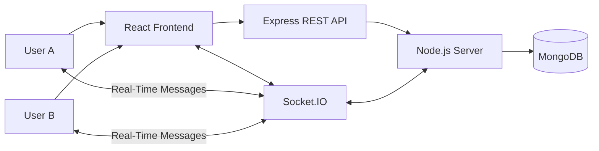

# 💬 One-to-One Real-Time Chat Application

> A modern, responsive, real-time one-to-one messaging application built with the **MERN Stack, Socket.IO, and Tailwind CSS**.

[](https://www.mongodb.com/)
[](https://expressjs.com/)
[](https://react.dev/)
[](https://nodejs.org/)
[](https://socket.io/)
[](https://tailwindcss.com/)

[](https://massengers.netlify.app/)
[](https://github.com/kavitasoren02/Massanger)

## 📚 Table of Contents

- [Project Overview](#-project-overview)
- [Key Features](#-key-features)
- [Technology Stack](#️-technology-stack)
- [Screenshots / Demo](#️-screenshots--demo)
- [Architecture Overview](#️-architecture-overview)
- [Real-Time Messaging](#-how-real-time-messaging-works)
- [Project Structure](#-project-structure)
- [Installation & Setup](#-installation--setup)
- [Environment Variables](#-environment-variables)
- [REST API Documentation](#-api-documentation)
- [Socket.IO Events](#-socketio-api)
- [Database Design](#️-database-design)
- [Authentication & Security](#-authentication--security)
- [Authentication Flow](#-authentication-flow)
- [Endpoint Summary](#-complete-rest-endpoint-summary)
- [Responsive UI](#-responsive-ui)
- [Future Improvements](#-future-improvements)
- [Testing](#-testing)
- [Production Build](#-production-build)
- [Contributing](#-contributing)
- [License](#-license)
- [Acknowledgements](#-acknowledgements)
- [Author](#-author)
- [Support](#-support)

---

## 📌 Project Overview

This project is a ****One-to-One Real-Time Chat Application**** that allows authenticated users to communicate privately through real-time messaging.

The application combines a ****MERN Stack frontend and backend**** with ****Socket.IO**** for real-time communication. Users can select another user, open a private conversation, send messages, and receive new messages without manually refreshing the page.

The interface is designed to be ****responsive, clean, and user-friendly****, making the application suitable for desktop and mobile devices.

---

## ✨ Key Features

* 💬 One-to-one private messaging
* ⚡ Real-time communication using Socket.IO
* 👤 User-based conversations
* 🔐 Authentication and protected application flow
* 📨 Send and receive messages in real time
* 🗄️ MongoDB-based message persistence
* 🔄 Real-time UI updates without page refresh
* 📱 Responsive chat interface
* 🎨 Tailwind CSS-based styling
* 👥 User/chat list interface
* 🕒 Message timestamps
* 🧩 Modular React component architecture
* 🔌 REST API + Socket.IO communication

---

## 🛠️ Technology Stack

\| Technology                  | Purpose                                               |
\| --------------------------- | ----------------------------------------------------- |
\| ****MongoDB****                 | Stores users, messages, and application data          |
\| ****Mongoose****                | MongoDB object modeling and schema management         |
\| ****Express.js****              | Handles backend HTTP APIs and routing                 |
\| ****Node.js****                 | JavaScript runtime for the backend                    |
\| ****React.js****                | Builds the interactive frontend                       |
\| ****Socket.IO****               | Enables real-time bidirectional communication         |
\| ****Tailwind CSS****            | Provides responsive utility-based styling             |
\| ****JavaScript / TypeScript**** | Application development                               |
\| ****Vite****                    | Frontend development and build tooling, if configured |

---

## 🖼️ Screenshots / Demo

### Login / Authentication

![Login Screen]\(./screenshots/Login.png)

### One-to-One Chat

![Chat Screen]\(./screenshots/ChatScreen.png)

### 📱 Mobile View

![Mobile Screenshot 1]\(./screenshots/Register%20Screen.jpg)

![Mobile Screenshot 2]\(./screenshots/LoginScreen.jpg)

![Mobile Screenshot 3]\(./screenshots/MobileChatScreen.jpg)

### 🎥 Live Demo

****Demo:**** `https://massengers.netlify.app`

****Repository:**** `https://github.com/kavitasoren02/Massanger`

---

## 🏗️ Architecture Overview

The application follows a client-server architecture where the React frontend communicates with the Node.js/Express backend through HTTP APIs, while Socket.IO provides real-time communication.



### High-Level Flow

```text
User
  │
  ▼
React Frontend
  │
  ├──────── HTTP ────────► Express / Node.js
  │                              │
  │                              ▼
  │                           MongoDB
  │
  └──── Socket.IO ─────────► Real-Time Server
                                  │
                                  ▼
                             Other User
```

---

## ⚡ How Real-Time Messaging Works

Socket.IO establishes a persistent communication channel between the frontend and backend.

### Message Flow

```text
User A
  │
  │ Sends message
  ▼
React Chat UI
  │
  │ Socket.IO
  ▼
Node.js + Socket.IO Server
  │
  ├── Process message
  │
  ├── Store message
  │      │
  │      ▼
  │    MongoDB
  │
  └── Emit message to User B
           │
           ▼
      User B's Chat UI
```

### Message Lifecycle

1. User A enters a message.
2. The React chat interface captures the message.
3. The client communicates with the backend.
4. Socket.IO handles real-time communication.
5. The backend processes the message.
6. The message is persisted in MongoDB.
7. Socket.IO delivers the message to the intended recipient.
8. User B's interface updates without refreshing the page.

*> Exact Socket.IO event names depend on the implementation and should be documented in the event table below.*

---

## 📁 Project Structure

Keep this structure synchronized with the actual repository.

```text
project-root/
│
├── frontend/
│   ├── public/
│   │
│   ├── src/
│   │   ├── components/
│   │   │   ├── [Chat Components]
│   │   │   ├── [Sidebar Components]
│   │   │   └── [UI Components]
│   │   │
│   │   ├── pages/
│   │   │   └── [Application Pages]
│   │   │
│   │   ├── services/
│   │   │   └── [API / Socket Services]
│   │   │
│   │   ├── utils/
│   │   │   └── [Utility Functions]
│   │   │
│   │   ├── assets/
│   │   │
│   │   ├── App.[js/tsx]
│   │   └── main.[js/tsx]
│   │
│   ├── package.json
│   └── [Frontend Configuration Files]
│
├── backend/
│   ├── src/
│   │   ├── controllers/
│   │   ├── routes/
│   │   ├── models/
│   │   ├── middleware/
│   │   ├── services/
│   │   ├── sockets/
│   │   ├── config/
│   │   └── utils/
│   │
│   ├── package.json
│   └── [Backend Configuration Files]
│
├── .gitignore
├── README.md
└── [Root Configuration Files]
```

*> Replace bracketed placeholders with the actual files and folders in the repository.*

---

## 🚀 Installation & Setup

### 1. Clone the Repository

```bash
git clone https://github.com/kavitasoren02/Massanger.git
cd Massanger
```

---

### 2. Backend Setup

Navigate to the backend directory:

```bash
cd backend
```

Install dependencies:

```bash
npm install
```

Create the environment file:

```text
.env
```

Example:

```env
PORT=<YOUR_BACKEND_PORT>
MONGODB_URI=<YOUR_MONGODB_CONNECTION_STRING>
<AUTH_VARIABLE>=<YOUR_AUTHENTICATION_VALUE>
<OTHER_VARIABLE>=<YOUR_REQUIRED_VALUE>
```

Start the backend:

```bash
npm run dev
```

Or use the production script configured in `package.json`:

```bash
npm start
```

---

### 3. Frontend Setup

Open a new terminal:

```bash
cd frontend
```

Install dependencies:

```bash
npm install
```

Create the environment file if required:

```text
.env
```

Example:

```env
<VITE_API_VARIABLE>=<YOUR_BACKEND_API_URL>
<VITE_SOCKET_VARIABLE>=<YOUR_SOCKET_SERVER_URL>
```

Start the frontend:

```bash
npm run dev
```

Open the development URL displayed in the terminal.

---

## 🔐 Environment Variables

Never commit real credentials, secrets, or `.env` files to GitHub.

Example:

```env
# Backend

PORT=<PORT>
MONGODB_URI=<MONGODB_CONNECTION_STRING>
<AUTH_SECRET_VARIABLE>=<SECRET>

# Frontend

<VITE_API_VARIABLE>=<BACKEND_API_URL>
<VITE_SOCKET_VARIABLE>=<SOCKET_SERVER_URL>
```

### Environment Variable Reference

\| Variable                 | Application | Description                          |
\| ------------------------ | ----------- | ------------------------------------ |
\| `PORT`                   | Backend     | Backend server port                  |
\| `MONGODB_URI`            | Backend     | MongoDB connection string            |
\| `<AUTH_SECRET_VARIABLE>` | Backend     | Authentication secret, if applicable |
\| `<VITE_API_VARIABLE>`    | Frontend    | Backend API URL, if configured       |
\| `<VITE_SOCKET_VARIABLE>` | Frontend    | Socket.IO server URL, if configured  |

*> Replace placeholders with the exact environment variable names used by the project.*

---

## 🔌 API Documentation

The exact API endpoints should be taken directly from the project's backend routes.

\| Method     | Endpoint            | Purpose              | Authentication              |
\| ---------- | ------------------- | -------------------- | --------------------------- |
\| `<METHOD>` | `<ACTUAL_ENDPOINT>` | `<Endpoint purpose>` | `<Required / Not Required>` |
\| `<METHOD>` | `<ACTUAL_ENDPOINT>` | `<Endpoint purpose>` | `<Required / Not Required>` |
\| `<METHOD>` | `<ACTUAL_ENDPOINT>` | `<Endpoint purpose>` | `<Required / Not Required>` |

### API Documentation Format

```text
Method:
<ACTUAL_METHOD>

Endpoint:
<ACTUAL_ENDPOINT>

Purpose:
<Endpoint purpose>

Authentication:
<Required / Not Required>

Request Body:
<Actual request body>

Response:
<Actual response>

Possible Errors:
<Actual errors>
```

*> Do not add endpoints that are not implemented in the project.*

---

## 🔄 Socket.IO Events

Document the exact Socket.IO events implemented in the source code.

\| Direction       | Event                 | Purpose     | Payload     |
\| --------------- | --------------------- | ----------- | ----------- |
\| Client → Server | `<ACTUAL_EVENT_NAME>` | `<Purpose>` | `<Payload>` |
\| Server → Client | `<ACTUAL_EVENT_NAME>` | `<Purpose>` | `<Payload>` |
\| Client → Server | `<ACTUAL_EVENT_NAME>` | `<Purpose>` | `<Payload>` |
\| Server → Client | `<ACTUAL_EVENT_NAME>` | `<Purpose>` | `<Payload>` |

### Event Documentation Format

```text
Event:
<ACTUAL_EVENT_NAME>

Direction:
Client → Server

Purpose:
<Describe the event>

Payload:
<Describe the actual payload>
```

*> Replace placeholders with the exact event names and payload structures used by the application.*

---

## 🗄️ Database Design

MongoDB is used for persistent application data.

The exact fields should match the Mongoose schemas implemented in the project.

### 👤 Users

\| Field     | Type     | Description     |
\| --------- | -------- | --------------- |
\| `<field>` | `<type>` | `<description>` |
\| `<field>` | `<type>` | `<description>` |
\| `<field>` | `<type>` | `<description>` |

---

### 💬 Messages

The message collection stores individual messages exchanged between users.

\| Field     | Type     | Description     |
\| --------- | -------- | --------------- |
\| `<field>` | `<type>` | `<description>` |
\| `<field>` | `<type>` | `<description>` |
\| `<field>` | `<type>` | `<description>` |
\| `<field>` | `<type>` | `<description>` |

Conceptual relationship:

```text
User
 │
 ├──── sends ────► Message
 │
 └──── receives ─► Message
```

---

### 🗨️ Conversations

If the application uses a separate conversation collection:

\| Field     | Type     | Description     |
\| --------- | -------- | --------------- |
\| `<field>` | `<type>` | `<description>` |
\| `<field>` | `<type>` | `<description>` |
\| `<field>` | `<type>` | `<description>` |

Conceptually:

```text
User A ───────┐
              │
              ▼
        Conversation
              ▲
              │
User B ───────┘
              │
              ▼
           Messages
```

*> Remove this section if the application does not use a separate conversation collection.*

---

## 🔐 Authentication & Security

### Authentication

* Protect authenticated routes.
* Verify authentication before allowing access to private resources.
* Never expose authentication secrets in frontend code.
* Store sensitive configuration in environment variables.
* Validate incoming request data on the backend.

### API Security

* Validate request parameters and request bodies.
* Restrict access to protected resources.
* Avoid exposing unnecessary user information.
* Handle authentication failures consistently.

## Base URL

For local development:

``` text
http://localhost:5000
```

Therefore, REST endpoints are normally accessed as:

``` text
http://localhost:5000/api/v1/...
```

If `PORT` is configured differently, replace `5000` with the configured
port.

---

# Authentication

The API uses a JWT authentication cookie named:

``` text
token
```

After a successful login, the server creates a JWT containing:

```json
{
  "userId": "USER_ID",
  "email": "user@example.com"
}
```

The token expires after ****1 day****.

Protected REST routes read the JWT from `req.cookies.token`. Socket.IO
authentication also reads the `token` cookie from the Socket.IO
handshake.

The server's cookie configuration currently uses:

\-   `httpOnly: true`
\-   `secure: true`
\-   `sameSite: "none"`
\-   `path: "/"`
\-   `maxAge: 9000000`

Because `secure` is enabled, HTTPS is required for the cookie to be sent
by a browser in normal production use.

---

# Common HTTP Responses

The API commonly uses these status codes:

  Status   Meaning
  **-------- --------------------------------------**
  `200`    Request completed successfully
  `201`    Resource created successfully
  `400`    Invalid request or validation error
  `401`    Authentication failed / unauthorized
  `404`    Resource or user not found
  `500`    Internal server error

---

# 1. Health Check

## GET `/health`

Checks whether the HTTP server is running.

### Authentication

Not required.

### Request

```http
GET /health
```

### Response

****200 OK****

```json
{
  "status": "OK"
}
```

---

# 2. User APIs

User routes are mounted under:

``` text
/api/v1/user
```

## 2.1 Register User

### POST `/api/v1/user/register`

Creates a new user account.

### Authentication

Not required.

### Request Body

```json
{
  "fullName": "John",
  "email": "john@example.com",
  "countryCode": "+91",
  "mobileNumber": "9876543210",
  "password": "password123"
}
```

Optional fields accepted by the validation layer include:

```json
{
  "profilePic": "https://example.com/profile.jpg",
  "status": "Available",
  "isOnline": false,
  "lastSeen": "2026-08-15T10:00:00.000Z"
}
```

### Validation

The current validation layer requires:

\-   `fullName` --- required and alphabetic
\-   `email` --- required and valid email
\-   `mobileNumber` --- required, exactly 10 digits
\-   `password` --- required, minimum 8 characters

### Success Response

****201 Created****

```json
{
  "message": "User registered successfully",
  "user": {
    "...": "created user document"
  }
}
```

### Error Response

****400 Bad Request****

```json
{
  "detail": "Email is required",
  "errors": []
}
```

****500 Internal Server Error****

```json
{
  "message": "Failed to register user",
  "error": "Error message"
}
```

---

## 2.2 Forgot Password

### POST `/api/v1/user/forgotpassword`

Creates a password reset token and sends a reset email.

### Authentication

Not required.

### Request Body

```json
{
  "email": "john@example.com"
}
```

### Success Response

****200 OK****

```json
{
  "message": "Password reset link sent successfully"
}
```

The reset link is generated using:

``` text
FRONTEND_URI/reset-password/{resetToken}
```

The reset token is stored hashed in the database and expires after **15
minutes**.

### Missing Email

****400 Bad Request****

```json
{
  "detail": "Email is required"
}
```

---

## 2.3 Validate Password Reset Token

### GET `/api/v1/user/validate-reset-token/:token`

Checks whether a password reset token is valid and has not expired.

### Path Parameter

  Parameter   Type     Required   Description
  **----------- -------- ---------- ----------------------**
  `token`     string   Yes        Password reset token

### Example

```http
GET /api/v1/user/validate-reset-token/RESET_TOKEN
```

### Success Response

****200 OK****

```json
{
  "message": "Reset token is valid "
}
```

### Invalid/Expired Token

The current implementation returns:

****500 Internal Server Error****

```json
{
  "message": "Invalid or expired token",
  "detail": "Invalid or expired reset token"
}
```

---

## 2.4 Change Password

### POST `/api/v1/user/change-password/:token`

Changes the user's password using a valid password reset token.

### Path Parameter

  Parameter   Type     Required   Description
  **----------- -------- ---------- ----------------------**
  `token`     string   Yes        Password reset token

### Request Body

```json
{
  "password": "newPassword123"
}
```

### Success Response

****200 OK****

```json
{
  "message": "Password changed successfully"
}
```

### Error Response

****500 Internal Server Error****

```json
{
  "message": "Password reset failed",
  "detail": "Invalid or expired reset token"
}
```

---

## 2.5 Get All Users

### GET `/api/v1/user/all-users`

Returns active users except the currently authenticated user.

The response also contains online/offline state, the latest message and
unseen message count for each user.

### Authentication

Required.

### Query Parameters

  Parameter      Type     Required   Description
  **-------------- -------- ---------- ------------------------------**
  `searchTerm`   string   No         Searches users by `fullName`

### Example

```http
GET /api/v1/user/all-users
```

With search:

```http
GET /api/v1/user/all-users?searchTerm=john
```

### Success Response

****200 OK****

```json
{
  "data": [
    {
      "_id": "USER_ID",
      "fullName": "John",
      "email": "john@example.com",
      "countryCode": "+91",
      "mobileNumber": "9876543210",
      "profilePic": "",
      "status": "Hey there!, I'm Using Messanger",
      "isOnline": true,
      "lastSeen": null,
      "isActive": true,
      "isDeleted": false,
      "lastMessage": {},
      "count": 2
    }
  ]
}
```

### Response Fields

---
  Field                               Description
  **----------------------------------- -----------------------------------**
  `isOnline`                          Whether a socket connection
                                      currently exists for the user

  `lastMessage`                       Latest message exchanged with the
                                      current user

  `count`                             Unseen message count
  \-----------------------------------------------------------------------

---

## 2.6 Get User By ID

### GET `/api/v1/user/getuserById/:id`

Returns a specific user and their current online status.

### Authentication

Required.

### Path Parameter

  Parameter   Type               Required
  **----------- ------------------ ----------**
  `id`        MongoDB ObjectId   Yes

### Example

```http
GET /api/v1/user/getuserById/64f123456789abcdef123456
```

### Success Response

****200 OK****

```json
{
  "data": {
    "_id": "64f123456789abcdef123456",
    "fullName": "John",
    "email": "john@example.com",
    "countryCode": "+91",
    "mobileNumber": "9876543210",
    "profilePic": "",
    "status": "Available",
    "isOnline": true,
    "lastSeen": null,
    "isActive": true,
    "isDeleted": false
  }
}
```

---

# 3. Authentication APIs

Authentication routes are mounted under:

``` text
/api/v1/auth
```

## 3.1 Login

### POST `/api/v1/auth/login`

Authenticates a user and creates a JWT.

### Authentication

Not required.

### Request Body

```json
{
  "email": "john@example.com",
  "password": "password123"
}
```

### Success Response

****200 OK****

```json
{
  "message": "Login successful",
  "token": "JWT_TOKEN",
  "user": {
    "id": "USER_ID",
    "email": "john@example.com",
    "fullName": "John"
  }
}
```

The server also sets the `token` cookie.

### User Not Found

****404 Not Found****

```json
{
  "message": "User not found"
}
```

### Invalid Password

****401 Unauthorized****

```json
{
  "message": "Invalid credentials"
}
```

---

## 3.2 Logout

### POST `/api/v1/auth/logout`

Removes the authentication cookie.

### Authentication

No explicit authentication middleware is attached to this route.

### Request

```http
POST /api/v1/auth/logout
```

### Success Response

****200 OK****

```json
{
  "message": "Logout Successfuly"
}
```

---

## 3.3 Get Current User Information

### GET `/api/v1/auth/info`

Returns the authenticated user's information.

### Authentication

Required.

### Request

```http
GET /api/v1/auth/info
```

The browser/client must send the `token` cookie.

### Success Response

****200 OK****

```json
{
  "user": {
    "...": "user document"
  }
}
```

### User Not Found

****404 Not Found****

```json
{
  "message": "User not found"
}
```

---

# 4. Message APIs

Message routes are mounted under:

``` text
/api/v1/messages
```

All message REST endpoints require authentication.

## Message Model

A message contains:

```json
{
  "senderId": "USER_ID",
  "recieverId": "USER_ID",
  "messageType": "text",
  "content": "Hello!",
  "fileId": "FILE_ID",
  "readStatus": "single_tick"
}
```

`fileId` is optional.

### Read Status

The server defines three read states:

  Value                Meaning
  **-------------------- -------------------**
  `single_tick`        Message sent
  `double_tick`        Message delivered
  `blue_double_tick`   Message read

---

## 4.1 Get Conversation Messages

### GET `/api/v1/messages`

Returns messages exchanged between two users.

### Query Parameters

  Parameter      Type     Required
  **-------------- -------- ----------**
  `senderId`     string   Yes
  `recieverId`   string   Yes

### Example

```http
GET /api/v1/messages?senderId=USER_A&recieverId=USER_B
```

### Success Response

****200 OK****

```json
{
  "message": "Messaged fetched successfully",
  "data": [
    {
      "_id": "MESSAGE_ID",
      "senderId": "USER_A",
      "recieverId": "USER_B",
      "messageType": "text",
      "content": "Hello!",
      "readStatus": "single_tick",
      "createdAt": "2026-08-15T10:00:00.000Z",
      "updatedAt": "2026-08-15T10:00:00.000Z"
    }
  ]
}
```

Messages are sorted by `createdAt` in ascending order.

### Missing Query Parameters

The current implementation returns:

****500 Internal Server Error****

```json
{
  "detail": "Please provide me Sender and Reciever id"
}
```

---

## 4.2 Update Message

### PUT `/api/v1/messages/:id`

Updates a message.

### Authentication

Required.

### Path Parameter

  Parameter   Type               Required
  **----------- ------------------ ----------**
  `id`        MongoDB ObjectId   Yes

### Request Body

A message object:

```json
{
  "senderId": "USER_ID",
  "recieverId": "USER_ID",
  "messageType": "text",
  "content": "Updated message",
  "readStatus": "single_tick"
}
```

### Success Response

****200 OK****

```json
{
  "message": "Message updated successfully",
  "data": {
    "...": "updated message"
  }
}
```

The service checks that the message belongs to the authenticated sender
before updating it.

---

## 4.3 Delete One Message

### DELETE `/api/v1/messages/:id`

Deletes a single message.

### Authentication

Required.

### Path Parameter

  Parameter   Type               Required
  **----------- ------------------ ----------**
  `id`        MongoDB ObjectId   Yes

### Example

```http
DELETE /api/v1/messages/MESSAGE_ID
```

### Success Response

****200 OK****

```json
{
  "message": "Message deleted successfully",
  "data": {
    "...": "deleted message"
  }
}
```

Only the sender is allowed to delete the message according to the
service-level ownership check.

---

## 4.4 Delete Conversation

### DELETE `/api/v1/messages`

Deletes all messages exchanged between the authenticated user and
another user.

### Query Parameters

  Parameter      Type     Required
  **-------------- -------- ----------**
  `recieverId`   string   Yes

### Example

```http
DELETE /api/v1/messages?recieverId=USER_B
```

### Success Response

****200 OK****

```json
{
  "message": "Message deleted successfully",
  "data": {
    "acknowledged": true,
    "deletedCount": 10
  }
}
```

---

# 5. Notification APIs

Notification routes are mounted under:

``` text
/api/v1/notifications
```

All notification routes require authentication.

The server stores Web Push subscriptions in an in-memory `Map`, keyed by
user ID.

---

## 5.1 Save Push Subscription

### POST `/api/v1/notifications/subscribe`

Associates a push subscription with the authenticated user.

### Request Body

```json
{
  "subscriptionId": {
    "...": "Web Push subscription object"
  }
}
```

The implementation accepts the `subscriptionId` value as-is.

### Success Response

****200 OK****

```json
{
  "message": "Subscription saved successfully"
}
```

### Missing Subscription

****404 Not Found****

```json
{
  "message": "SubscriptionId not found"
}
```

---

# 6. Socket.IO API

The server also provides real-time communication through Socket.IO.

The Socket.IO server is attached to the same HTTP server and uses the
same configured frontend origin.

### Connection

``` text
http://localhost:5000
```

The Socket.IO connection requires the `token` cookie.

The socket authentication middleware reads:

``` text
Cookie: token=JWT_TOKEN
```

and verifies the JWT before allowing the connection.

---

### Socket.IO Security

Socket connections should verify the authenticated user where authentication is required.

Private messages should only be delivered to the intended recipient or authorized conversation.

## 6.1 User Connected

### Server Broadcast Event

``` text
topic/userConnected
```

Emitted when a user successfully connects.

### Payload

```json
{
  "userId": "USER_ID"
}
```

This event is broadcast to other connected users.

---

## 6.2 Send Message

### Client → Server

``` text
topic/sendMessage
```

### Payload

```json
{
  "senderId": "USER_A",
  "recieverId": "USER_B",
  "messageType": "text",
  "content": "Hello!",
  "readStatus": "single_tick"
}
```

The server:

1.  Checks whether the receiver is online.
2.  Sets `readStatus` to `double_tick` when the receiver is connected.
3.  Saves the message to MongoDB.
4.  Sends the message to the receiver.
5.  Sends the saved message back to the sender through
    `topic/updateMessage`.
6.  Attempts to send a Web Push notification to the receiver.

### Receiver Event

``` text
topic/receiveMessage
```

Payload:

```json
{
  "_id": "MESSAGE_ID",
  "senderId": "USER_A",
  "recieverId": "USER_B",
  "messageType": "text",
  "content": "Hello!",
  "readStatus": "double_tick"
}
```

### Sender Update Event

``` text
topic/updateMessage
```

Payload:

```json
{
  "...": "saved message"
}
```

### Failure Event

``` text
topic/messageFailed
```

Payload:

```json
null
```

---

## 6.3 Typing Indicator

### Client → Server

``` text
topic/typing
```

### Payload

```json
{
  "senderId": "USER_A",
  "recieverId": "USER_B"
}
```

### Receiver Event

``` text
topic/isTyping
```

When typing starts:

```json
{
  "senderId": "USER_A",
  "recieverId": "USER_B",
  "isTyping": true
}
```

After approximately ****2.5 seconds**** without another typing event, the
server emits:

```json
{
  "senderId": "USER_A",
  "recieverId": "USER_B",
  "isTyping": false
}
```

---

## 6.4 Blue Tick / Read Message

### Client → Server

``` text
topic/bluetickMessage
```

### Payload

```json
{
  "recieverId": "USER_A",
  "ids": [
    "MESSAGE_ID_1",
    "MESSAGE_ID_2"
  ]
}
```

The server:

1.  Emits `topic/updateBluetickMessage` to the receiver's socket when
    available.
2.  Updates the supplied message IDs to `blue_double_tick` in MongoDB.

### Receiver Event

``` text
topic/updateBluetickMessage
```

Payload:

```json
{
  "recieverId": "USER_A",
  "ids": [
    "MESSAGE_ID_1",
    "MESSAGE_ID_2"
  ]
}
```

---

## 6.5 Double Tick on Connection

When a user connects, the server looks for received messages that are
still in `single_tick` state.

For applicable messages it:

1.  Emits `topic/updatedoubletickmessage` to the original sender.
2.  Updates those messages to `double_tick` in MongoDB.

### Event

``` text
topic/updatedoubletickmessage
```

The payload contains grouped message information and message IDs.

---

## 6.6 User Disconnected

### Server Broadcast Event

``` text
topic/userDisconnected
```

Emitted when a socket disconnects.

### Payload

```json
{
  "userId": "USER_ID",
  "lastSeenDate": "2026-08-15T10:30:00.000Z"
}
```

The server also updates the user's `lastSeen` value in MongoDB.

---

# 7. Authentication Flow

A typical client flow is:

``` text
Register
   |
   v
POST /api/v1/user/register
   |
   v
Login
   |
   v
POST /api/v1/auth/login
   |
   +----> JWT token returned
   |
   +----> HTTP-only token cookie created
   |
   v
Authenticated REST requests
   |
   +----> GET /api/v1/auth/info
   +----> GET /api/v1/user/all-users
   +----> GET /api/v1/messages
   +----> POST /api/v1/notifications/subscribe
   |
   v
Socket.IO connection
   |
   +----> token cookie verified
   |
   v
Real-time messaging
```

---

# 8. Complete REST Endpoint Summary

---
  Method           Endpoint                                                      Auth Purpose
  **---------------- -------------------------------------------- --------------------- ----------------**
  GET              `/health`                                                       No Health check

  POST             `/api/v1/user/register`                                         No Register user

  POST             `/api/v1/user/forgotpassword`                                   No Request password
                                                                                      reset

  GET              `/api/v1/user/validate-reset-token/:token`                      No Validate reset
                                                                                      token

  POST             `/api/v1/user/change-password/:token`                           No Change password

  GET              `/api/v1/user/all-users`                                       Yes Get users/search
                                                                                      users

  GET              `/api/v1/user/getuserById/:id`                                 Yes Get user by ID

  POST             `/api/v1/auth/login`                                            No Login

  POST             `/api/v1/auth/logout`                                           No Logout

  GET              `/api/v1/auth/info`                                            Yes Get
                                                                                      authenticated
                                                                                      user

  GET              `/api/v1/messages`                                             Yes Get conversation
                                                                                      messages

  PUT              `/api/v1/messages/:id`                                         Yes Update message

  DELETE           `/api/v1/messages`                                             Yes Delete
                                                                                      conversation

  DELETE           `/api/v1/messages/:id`                                         Yes Delete message

  POST             `/api/v1/notifications/subscribe`                              Yes Save push
                                                                                      subscription
  \----------------------------------------------------------------------------------------------------

---

# 9. Socket Event Summary

---
  Direction               Event                             Purpose
  **----------------------- --------------------------------- -----------------------**
  Server → Client         `topic/userConnected`             Notify users that a
                                                            user connected

  Client → Server         `topic/sendMessage`               Send a real-time
                                                            message

  Server → Client         `topic/receiveMessage`            Deliver a message

  Server → Client         `topic/updateMessage`             Update sender with
                                                            saved message

  Server → Client         `topic/messageFailed`             Notify sender of
                                                            message failure

  Client → Server         `topic/typing`                    Send typing state

  Server → Client         `topic/isTyping`                  Broadcast typing state

  Client → Server         `topic/bluetickMessage`           Mark messages as read

  Server → Client         `topic/updateBluetickMessage`     Notify read-state
                                                            update

  Server → Client         `topic/updatedoubletickmessage`   Notify delivery-state
                                                            update

  Server → Client         `topic/userDisconnected`          Notify users of
                                                            disconnect
  \---------------------------------------------------------------------------------

---

### MongoDB Security

* Keep MongoDB credentials outside source control.
* Use environment variables for connection strings.
* Apply appropriate database permissions.
* Avoid storing sensitive information unnecessarily.

---

## 📱 Responsive UI

The application is designed to provide a responsive chat experience across different screen sizes.

### Supported Layouts

* 🖥️ Desktop
* 💻 Tablet
* 📱 Mobile
* 📋 Responsive sidebar
* 💬 Responsive message area
* ⌨️ Mobile-friendly message input
* 🎨 Responsive Tailwind CSS styling

---

## API Prefix

All REST APIs except the health endpoint use:

``` text
/api/v1
```

Example:

``` text
GET http://localhost:5000/api/v1/auth/info
```

## 🔮 Future Improvements

The application can be extended with additional communication features.

### ⌨️ Typing Indicators

Display when another user is currently typing.

### ✅ Read Receipts

Show whether messages have been delivered or read.

### ❤️ Message Reactions

Allow users to react to individual messages.

### 📎 File Sharing

Support sharing images, documents, and other supported files.

### 👥 Group Chats

Allow multiple users to participate in a single conversation.

### 📞 Voice Calling

Add real-time audio communication.

### 🎥 Video Calling

Add real-time video communication.

### 🔔 Push Notifications

Notify users when new messages are received.

### 🔎 Message Search

Allow users to search messages within conversations.

---

## 🧪 Testing

Add the project's actual testing command once a testing setup is configured.

```bash
npm test
```

*> Replace this with the actual command defined by the project.*

---

## 🏭 Production Build

Build the frontend using the script configured in `package.json`:

```bash
npm run build
```

Start the backend using the production script configured in `package.json`:

```bash
npm start
```

---

## 🤝 Contributing

Contributions are welcome.

### Contribution Workflow

1. Fork the repository.
2. Clone your fork.
3. Create a feature branch.

```bash
git checkout -b feature/your-feature
```

4. Make your changes.
5. Test the application.
6. Commit your changes.

```bash
git add .
git commit -m "feat: add your feature"
```

7. Push your branch.

```bash
git push origin feature/your-feature
```

8. Open a Pull Request.

### Contribution Guidelines

* Keep changes focused and maintainable.
* Follow the existing project structure.
* Use meaningful variable and function names.
* Do not commit secrets or environment files.
* Update documentation when adding functionality.
* Test changes before submitting a Pull Request.

---

## 📄 License

This project is licensed under the ****[Choose License]****.

Replace this section with the actual license used by the repository.

Example:

```text
MIT License
```

---

## 🙏 Acknowledgements

This project was built using open-source technologies including:

* [MongoDB]\(https://www.mongodb.com/)
* [Express.js]\(https://expressjs.com/)
* [React]\(https://react.dev/)
* [Node.js]\(https://nodejs.org/)
* [Socket.IO]\(https://socket.io/)
* [Tailwind CSS]\(https://tailwindcss.com/)

Special thanks to the open-source community for the tools and resources that support modern web development.

---

## 👩‍💻 Author

### Kavita Soren

* ****GitHub:**** `<YOUR_GITHUB_PROFILE_URL>`
* ****LinkedIn:**** `<YOUR_LINKEDIN_PROFILE_URL>`
* ****Portfolio:**** `<YOUR_PORTFOLIO_URL>`
* ****Email:**** `<YOUR_EMAIL_ADDRESS>`

---

## ⭐ Support

If you find this project useful, consider giving the repository a ⭐ on GitHub.

Feedback, suggestions, and contributions are always welcome.

---

## 📌 Project Summary

```text
One-to-One Real-Time Chat Application
│
├── React.js + Tailwind CSS
│   ├── Responsive Chat UI
│   ├── User Interface
│   └── Message Interface
│
├── Node.js + Express.js
│   ├── REST APIs
│   └── Server-side Logic
│
├── Socket.IO
│   └── Real-Time Communication
│
└── MongoDB
    ├── Users
    ├── Messages
    └── Conversations
```

*>* ****Built with the MERN Stack and Socket.IO to provide a fast, responsive, and real-time one-to-one messaging experience.****
