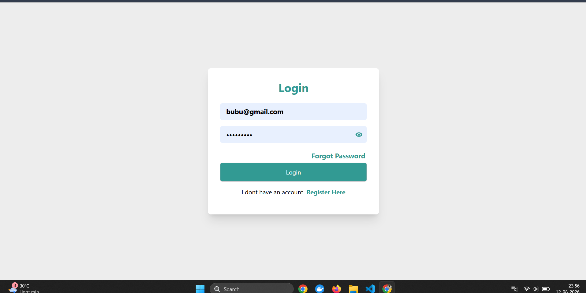
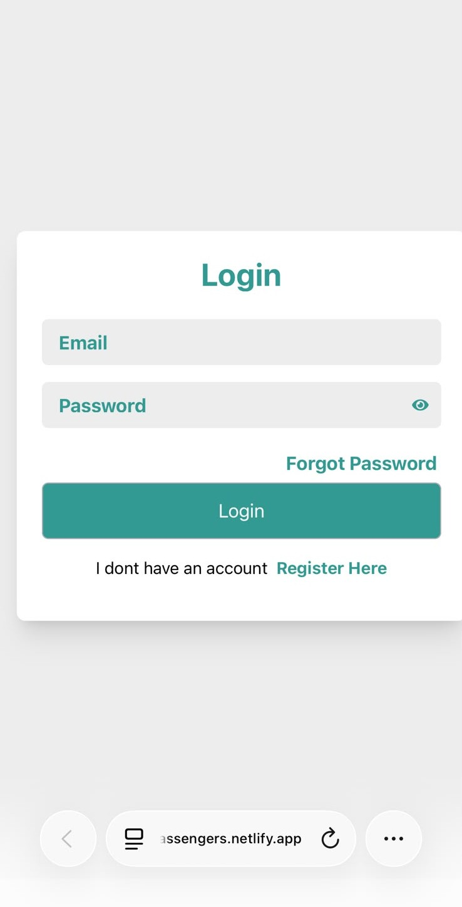
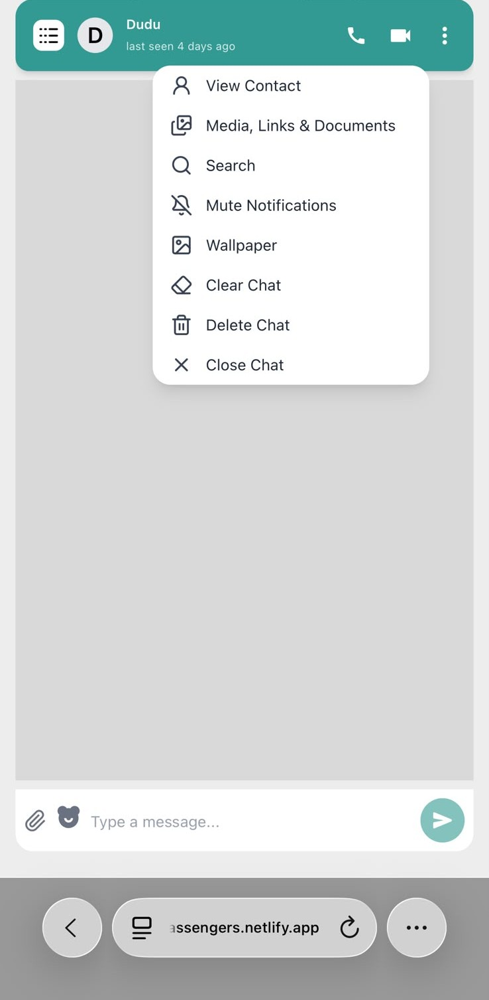
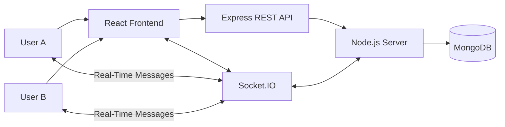

# 💬 One-to-One Real-Time Chat Application

> A modern, responsive, and real-time one-to-one messaging application built with the **MERN Stack, Socket.IO, and Tailwind CSS**.

[](https://www.mongodb.com/)
[](https://expressjs.com/)
[](https://react.dev/)
[](https://nodejs.org/)
[](https://socket.io/)
[](https://tailwindcss.com/)

---

## 📌 Project Overview

This project is a **One-to-One Real-Time Chat Application** that allows authenticated users to communicate privately through real-time messaging.

The application combines a **MERN Stack frontend and backend** with **Socket.IO** for real-time communication. Users can select another user, open a private conversation, send messages, and receive new messages without manually refreshing the page.

The interface is designed to be **responsive, clean, and user-friendly**, making the application suitable for desktop and mobile devices.

---

## ✨ Key Features

* 💬 One-to-one private messaging
* ⚡ Real-time communication using Socket.IO
* 👤 User-based conversations
* 🔐 Authentication and protected application flow
* 📨 Send and receive messages in real time
* 🗄️ MongoDB-based message persistence
* 🔄 Real-time UI updates without page refresh
* 📱 Responsive chat interface
* 🎨 Tailwind CSS-based styling
* 👥 User/chat list interface
* 🕒 Message timestamps
* 🧩 Modular React component architecture
* 🔌 REST API + Socket.IO communication

---

## 🛠️ Technology Stack

| Technology                  | Purpose                                               |
| --------------------------- | ----------------------------------------------------- |
| **MongoDB**                 | Stores users, messages, and application data          |
| **Mongoose**                | MongoDB object modeling and schema management         |
| **Express.js**              | Handles backend HTTP APIs and routing                 |
| **Node.js**                 | JavaScript runtime for the backend                    |
| **React.js**                | Builds the interactive frontend                       |
| **Socket.IO**               | Enables real-time bidirectional communication         |
| **Tailwind CSS**            | Provides responsive utility-based styling             |
| **JavaScript / TypeScript** | Application development                               |
| **Vite**                    | Frontend development and build tooling, if configured |

---

## 🖼️ Screenshots / Demo

### Login / Authentication

```text
```

### One-to-One Chat

```text
[ Add Chat Screenshot Here ](./screenshots/ChatScreen.png)
```

### Responsive Mobile View
### 📱 Mobile View






### 🎥 Live Demo

**Demo:** `https://massengers.netlify.app`

**Repository:** `https://github.com/kavitasoren02/Massanger`

---

## 🏗️ Architecture Overview

The application follows a client-server architecture where the React frontend communicates with the Node.js/Express backend through HTTP APIs, while Socket.IO provides real-time communication.



### High-Level Flow

```text
User
  │
  ▼
React Frontend
  │
  ├──────── HTTP ────────► Express / Node.js
  │                              │
  │                              ▼
  │                           MongoDB
  │
  └──── Socket.IO ─────────► Real-Time Server
                                  │
                                  ▼
                             Other User
```

---

## ⚡ How Real-Time Messaging Works

Socket.IO establishes a persistent communication channel between the frontend and backend.

### Message Flow

```text
User A
  │
  │ Sends message
  ▼
React Chat UI
  │
  │ Socket.IO
  ▼
Node.js + Socket.IO Server
  │
  ├── Process message
  │
  ├── Store message
  │      │
  │      ▼
  │    MongoDB
  │
  └── Emit message to User B
           │
           ▼
      User B's Chat UI
```

### Message Lifecycle

1. User A enters a message.
2. The React chat interface captures the message.
3. The client communicates with the backend.
4. Socket.IO handles real-time communication.
5. The backend processes the message.
6. The message is persisted in MongoDB.
7. Socket.IO delivers the message to the intended recipient.
8. User B's interface updates without refreshing the page.

> Exact Socket.IO event names depend on the implementation and should be documented in the event table below.

---

## 📁 Project Structure

Keep this structure synchronized with the actual repository.

```text
project-root/
│
├── frontend/
│   ├── public/
│   │
│   ├── src/
│   │   ├── components/
│   │   │   ├── [Chat Components]
│   │   │   ├── [Sidebar Components]
│   │   │   └── [UI Components]
│   │   │
│   │   ├── pages/
│   │   │   └── [Application Pages]
│   │   │
│   │   ├── services/
│   │   │   └── [API / Socket Services]
│   │   │
│   │   ├── utils/
│   │   │   └── [Utility Functions]
│   │   │
│   │   ├── assets/
│   │   │
│   │   ├── App.[js/tsx]
│   │   └── main.[js/tsx]
│   │
│   ├── package.json
│   └── [Frontend Configuration Files]
│
├── backend/
│   ├── src/
│   │   ├── controllers/
│   │   ├── routes/
│   │   ├── models/
│   │   ├── middleware/
│   │   ├── services/
│   │   ├── sockets/
│   │   ├── config/
│   │   └── utils/
│   │
│   ├── package.json
│   └── [Backend Configuration Files]
│
├── .gitignore
├── README.md
└── [Root Configuration Files]
```

> Replace bracketed placeholders with the actual files and folders in the repository.

---

## 🚀 Installation & Setup

### 1. Clone the Repository

```bash
git clone <YOUR_GITHUB_REPOSITORY_URL>
cd <PROJECT_DIRECTORY>
```

---

### 2. Backend Setup

Navigate to the backend directory:

```bash
cd backend
```

Install dependencies:

```bash
npm install
```

Create the environment file:

```text
.env
```

Example:

```env
PORT=<YOUR_BACKEND_PORT>
MONGODB_URI=<YOUR_MONGODB_CONNECTION_STRING>
<AUTH_VARIABLE>=<YOUR_AUTHENTICATION_VALUE>
<OTHER_VARIABLE>=<YOUR_REQUIRED_VALUE>
```

Start the backend:

```bash
npm run dev
```

Or use the production script configured in `package.json`:

```bash
npm start
```

---

### 3. Frontend Setup

Open a new terminal:

```bash
cd frontend
```

Install dependencies:

```bash
npm install
```

Create the environment file if required:

```text
.env
```

Example:

```env
<VITE_API_VARIABLE>=<YOUR_BACKEND_API_URL>
<VITE_SOCKET_VARIABLE>=<YOUR_SOCKET_SERVER_URL>
```

Start the frontend:

```bash
npm run dev
```

Open the development URL displayed in the terminal.

---

## 🔐 Environment Variables

Never commit real credentials, secrets, or `.env` files to GitHub.

Example:

```env
# Backend
PORT=<PORT>
MONGODB_URI=<MONGODB_CONNECTION_STRING>
<AUTH_SECRET_VARIABLE>=<SECRET>

# Frontend
<VITE_API_VARIABLE>=<BACKEND_API_URL>
<VITE_SOCKET_VARIABLE>=<SOCKET_SERVER_URL>
```

### Environment Variable Reference

| Variable                 | Application | Description                          |
| ------------------------ | ----------- | ------------------------------------ |
| `PORT`                   | Backend     | Backend server port                  |
| `MONGODB_URI`            | Backend     | MongoDB connection string            |
| `<AUTH_SECRET_VARIABLE>` | Backend     | Authentication secret, if applicable |
| `<VITE_API_VARIABLE>`    | Frontend    | Backend API URL, if configured       |
| `<VITE_SOCKET_VARIABLE>` | Frontend    | Socket.IO server URL, if configured  |

> Replace placeholders with the exact environment variable names used by the project.

---

## 🔌 API Documentation

The exact API endpoints should be taken directly from the project's backend routes.

| Method     | Endpoint            | Purpose              | Authentication              |
| ---------- | ------------------- | -------------------- | --------------------------- |
| `<METHOD>` | `<ACTUAL_ENDPOINT>` | `<Endpoint purpose>` | `<Required / Not Required>` |
| `<METHOD>` | `<ACTUAL_ENDPOINT>` | `<Endpoint purpose>` | `<Required / Not Required>` |
| `<METHOD>` | `<ACTUAL_ENDPOINT>` | `<Endpoint purpose>` | `<Required / Not Required>` |

### API Documentation Format

```text
Method:
<ACTUAL_METHOD>

Endpoint:
<ACTUAL_ENDPOINT>

Purpose:
<Endpoint purpose>

Authentication:
<Required / Not Required>

Request Body:
<Actual request body>

Response:
<Actual response>

Possible Errors:
<Actual errors>
```

> Do not add endpoints that are not implemented in the project.

---

## 🔄 Socket.IO Events

Document the exact Socket.IO events implemented in the source code.

| Direction       | Event                 | Purpose     | Payload     |
| --------------- | --------------------- | ----------- | ----------- |
| Client → Server | `<ACTUAL_EVENT_NAME>` | `<Purpose>` | `<Payload>` |
| Server → Client | `<ACTUAL_EVENT_NAME>` | `<Purpose>` | `<Payload>` |
| Client → Server | `<ACTUAL_EVENT_NAME>` | `<Purpose>` | `<Payload>` |
| Server → Client | `<ACTUAL_EVENT_NAME>` | `<Purpose>` | `<Payload>` |

### Event Documentation Format

```text
Event:
<ACTUAL_EVENT_NAME>

Direction:
Client → Server

Purpose:
<Describe the event>

Payload:
<Describe the actual payload>
```

> Replace placeholders with the exact event names and payload structures used by the application.

---

## 🗄️ Database Design

MongoDB is used for persistent application data.

The exact fields should match the Mongoose schemas implemented in the project.

### 👤 Users

| Field     | Type     | Description     |
| --------- | -------- | --------------- |
| `<field>` | `<type>` | `<description>` |
| `<field>` | `<type>` | `<description>` |
| `<field>` | `<type>` | `<description>` |

---

### 💬 Messages

The message collection stores individual messages exchanged between users.

| Field     | Type     | Description     |
| --------- | -------- | --------------- |
| `<field>` | `<type>` | `<description>` |
| `<field>` | `<type>` | `<description>` |
| `<field>` | `<type>` | `<description>` |
| `<field>` | `<type>` | `<description>` |

Conceptual relationship:

```text
User
 │
 ├──── sends ────► Message
 │
 └──── receives ─► Message
```

---

### 🗨️ Conversations

If the application uses a separate conversation collection:

| Field     | Type     | Description     |
| --------- | -------- | --------------- |
| `<field>` | `<type>` | `<description>` |
| `<field>` | `<type>` | `<description>` |
| `<field>` | `<type>` | `<description>` |

Conceptually:

```text
User A ───────┐
              │
              ▼
        Conversation
              ▲
              │
User B ───────┘
              │
              ▼
           Messages
```

> Remove this section if the application does not use a separate conversation collection.

---

## 🔐 Authentication & Security

### Authentication

* Protect authenticated routes.
* Verify authentication before allowing access to private resources.
* Never expose authentication secrets in frontend code.
* Store sensitive configuration in environment variables.
* Validate incoming request data on the backend.

### API Security

* Validate request parameters and request bodies.
* Restrict access to protected resources.
* Avoid exposing unnecessary user information.
* Handle authentication failures consistently.

### Socket.IO Security

Socket connections should verify the authenticated user where authentication is required.

Private messages should only be delivered to the intended recipient or authorized conversation.

### MongoDB Security

* Keep MongoDB credentials outside source control.
* Use environment variables for connection strings.
* Apply appropriate database permissions.
* Avoid storing sensitive information unnecessarily.

---

## 📱 Responsive UI

The application is designed to provide a responsive chat experience across different screen sizes.

### Supported Layouts

* 🖥️ Desktop
* 💻 Tablet
* 📱 Mobile
* 📋 Responsive sidebar
* 💬 Responsive message area
* ⌨️ Mobile-friendly message input
* 🎨 Responsive Tailwind CSS styling

---

## 🔮 Future Improvements

The application can be extended with additional communication features.

### ⌨️ Typing Indicators

Display when another user is currently typing.

### ✅ Read Receipts

Show whether messages have been delivered or read.

### ❤️ Message Reactions

Allow users to react to individual messages.

### 📎 File Sharing

Support sharing images, documents, and other supported files.

### 👥 Group Chats

Allow multiple users to participate in a single conversation.

### 📞 Voice Calling

Add real-time audio communication.

### 🎥 Video Calling

Add real-time video communication.

### 🔔 Push Notifications

Notify users when new messages are received.

### 🔎 Message Search

Allow users to search messages within conversations.

---

## 🧪 Testing

Add the project's actual testing command once a testing setup is configured.

```bash
npm test
```

> Replace this with the actual command defined by the project.

---

## 🏭 Production Build

Build the frontend using the script configured in `package.json`:

```bash
npm run build
```

Start the backend using the production script configured in `package.json`:

```bash
npm start
```

---

## 🤝 Contributing

Contributions are welcome.

### Contribution Workflow

1. Fork the repository.
2. Clone your fork.
3. Create a feature branch.

```bash
git checkout -b feature/your-feature
```

4. Make your changes.
5. Test the application.
6. Commit your changes.

```bash
git add .
git commit -m "feat: add your feature"
```

7. Push your branch.

```bash
git push origin feature/your-feature
```

8. Open a Pull Request.

### Contribution Guidelines

* Keep changes focused and maintainable.
* Follow the existing project structure.
* Use meaningful variable and function names.
* Do not commit secrets or environment files.
* Update documentation when adding functionality.
* Test changes before submitting a Pull Request.

---

## 📄 License

This project is licensed under the **[Choose License]**.

Replace this section with the actual license used by the repository.

Example:

```text
MIT License
```

---

## 🙏 Acknowledgements

This project was built using open-source technologies including:

* [MongoDB](https://www.mongodb.com/)
* [Express.js](https://expressjs.com/)
* [React](https://react.dev/)
* [Node.js](https://nodejs.org/)
* [Socket.IO](https://socket.io/)
* [Tailwind CSS](https://tailwindcss.com/)

Special thanks to the open-source community for the tools and resources that support modern web development.

---

## 👩‍💻 Author

### Kavita Soren

* **GitHub:** `<YOUR_GITHUB_PROFILE_URL>`
* **LinkedIn:** `<YOUR_LINKEDIN_PROFILE_URL>`
* **Portfolio:** `<YOUR_PORTFOLIO_URL>`
* **Email:** `<YOUR_EMAIL_ADDRESS>`

---

## ⭐ Support

If you find this project useful, consider giving the repository a ⭐ on GitHub.

Feedback, suggestions, and contributions are always welcome.

---

## 📌 Project Summary

```text
One-to-One Real-Time Chat Application
│
├── React.js + Tailwind CSS
│   ├── Responsive Chat UI
│   ├── User Interface
│   └── Message Interface
│
├── Node.js + Express.js
│   ├── REST APIs
│   └── Server-side Logic
│
├── Socket.IO
│   └── Real-Time Communication
│
└── MongoDB
    ├── Users
    ├── Messages
    └── Conversations
```

> **Built with the MERN Stack and Socket.IO to provide a fast, responsive, and real-time one-to-one messaging experience.**
